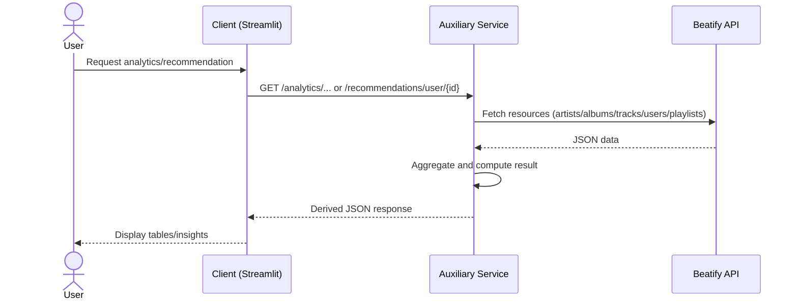

# Beatify Auxiliary Service

## Purpose

This service provides value-added endpoints built on top of Beatify API data:

- Cross-resource analytics (counts, ratios, averages)
- Top artist ranking by derived track count
- Personalized track recommendations by user playlist history

Main API target:

- `http://130.162.240.153:5000/Beatify/api/v1`

Service runs locally by default:

- `http://localhost:7000`

## Why This Is an Auxiliary Service

The service encapsulates aggregated and computed logic that is not a direct CRUD operation:

- It joins data across resources (artists, albums, tracks, users, playlists).
- It computes metrics and ranking values.
- It offers recommendation logic reusable by multiple clients.

This separation keeps the core API focused on canonical data operations while allowing new analysis features to evolve independently.

## Endpoints

| Endpoint | Method | Description |
|----------|--------|-------------|
| `/` | GET | Service metadata and endpoint index |
| `/analytics/summary` | GET | Global counts and metrics |
| `/analytics/top-artists` | GET | Top artists by number of tracks |
| `/recommendations/user/{user_id}` | GET | Track recommendations for a user |

## Install and Run

```bash
cd deadline5/auxiliary_service
pip install -r requirements.txt
python service.py
```

## Communication Diagram



## Linting

```bash
cd API_Client_Auxiliary_service/auxiliary_service
pylint service.py --rcfile=../.pylintrc --reports=y
```

## Sources

- Flask docs: https://flask.palletsprojects.com/
- Requests docs: https://requests.readthedocs.io/

## Credit
A lot of help is taken from Claude in coding Aux service