# Beatify Deployment Guide

This document describes a production-style deployment setup for Beatify using Docker, NGINX, Gunicorn, and GitHub Actions.

## Tools and Frameworks

- Docker: packages the API and dependencies into reproducible containers.
- Docker Compose: orchestrates multi-service local/prod-like environment.
- Gunicorn (WSGI application server): runs the Flask app in production mode.
- NGINX (web server / reverse proxy): serves static files and forwards API traffic to Gunicorn.
- GitHub Actions: runs CI tests and builds/pushes Docker image to GHCR.
- GHCR (GitHub Container Registry): stores the built deployment image.

## Architecture Diagram

```mermaid
flowchart LR
    Client[Client Browser / API Consumer]
  NGINX[NGINX Web Server\nport 80]
  GUNICORN[Gunicorn WSGI\nBeatify.wsgi:app\nport 5000]
    SQLITE[(SQLite DB\ninstance/test.db)]
    GHA[GitHub Actions CI/CD]
    GHCR[GHCR Container Registry]
    CLOUD[Cloud Runtime\nRender/Railway/VM]

    Client -->|HTTP/HTTPS| NGINX
    NGINX -->|HTTP proxy| GUNICORN
    GUNICORN -->|SQLAlchemy| SQLITE

    GHA -->|build/push image| GHCR
    GHCR -->|pull image| CLOUD
    CLOUD -->|public endpoint| Client
```



## Why This Stack

- Application Server: Flask is executed by Gunicorn (WSGI), not the Flask debug server.
- Web Server: NGINX handles edge HTTP traffic and serves `/static` content directly.
- Process startup: Docker entrypoint runs Gunicorn directly.

## Local Deployment with Docker Compose

Run from project root:

```bash
docker compose up --build
```

API endpoint:

```text
http://localhost:5000/Beatify/api/v1/artists
```

Swagger UI:

```text
http://localhost:5000/Beatify/api/v1/docs
```

OpenAPI spec:

```text
http://localhost:5000/Beatify/api/v1/openapi.yaml
```

Root endpoint:

```text
http://localhost:5000/
```

Stop services:

```bash
docker compose down
```

## GitHub Actions CI/CD

Workflow file:

- `.github/workflows/ci-cd.yml`

Pipeline behavior:

- On PR and push: run tests (`pytest`) with coverage.
- On push to `main`: build Docker image and push to GHCR.
- Optional deploy hook: if `RENDER_DEPLOY_HOOK` secret is defined, it triggers cloud redeploy.

## GitHub Secrets (for deployment)

Set these in repository settings:

- `RENDER_DEPLOY_HOOK` (optional): Render deploy hook URL.

No extra secret is needed for GHCR push because workflow uses `GITHUB_TOKEN`.

## Cloud Deployment Notes

You can deploy the GHCR image on services such as Render, Railway, Fly.io, or your own VM.

Minimum production settings to configure on your host platform:

- Public port mapping to NGINX (`80` in container).
- Persistent storage for `instance/` if SQLite data should survive restarts.
- Environment variables as needed:
  - `INIT_DB=true|false`
  - `POPULATE_DB=true|false`
    - Current default in Compose is `POPULATE_DB=true` (seeds sample data on first startup)

## Documentation and API Criteria Checklist Support

This deployment setup directly supports criteria for:

- VM/Docker isolation.
- Use of web server + application server.
- Monitor/control system.
- Architecture diagram.
- Tooling description.

For API documentation criteria (OpenAPI validity, examples, response codes), maintain the OpenAPI spec at `docs/openapi.yaml` and validate it with Swagger Editor and:

```bash
python -m openapi_spec_validator docs/openapi.yaml
```
